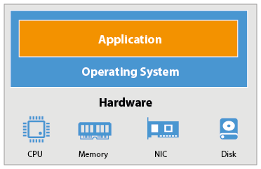
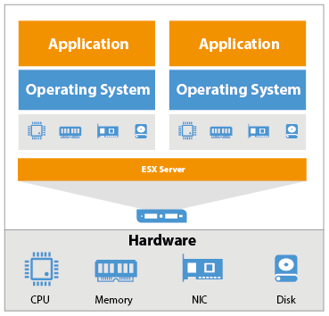
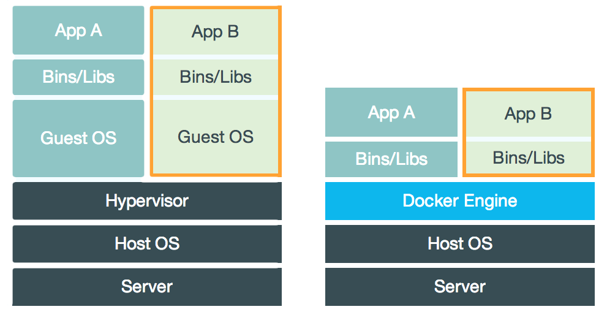

<!-- section start -->
<!-- attr: { id:'title', class:'slide-title', hasScriptWrapper:true } -->
# Containers
##  Breif history and overview

<div class="signature">
    <p class="signature-course">Web applications with Node.js</p>
    <p class="signature-initiative">Telerik Software Academy</p>
    <a href="http://academy.telerik.com" class="signature-link">http://academy.telerik.com</a>
</div>

<!-- section start -->

# Table of Contents

- Breif history
  - How IT developed over the years
- The Docker Project
  - The what and why of Docker
- Docker in action
  - The how of Docker
- Docker in-depth 
<!-- section start -->

<!-- attr: {class: 'slide-section', showInPresentation: true} -->
# Breif history
## How IT developed over the years

<!-- attr: {showInPresentation: true, hasScriptWrapper:true} -->
# Physical machines

- Each application runs on a seperate `physical machine`, which causes problems:
  - Procurement time
  - Power solutions
  - Cooling solutions
  - Administration 
  - Low utilization

<!--  -->

# Virtual machines
- Each application runs on a seperate `virtual machine`, on top of a `physical` one:
  - This solves `some` of the problems stated above, but causes:
    - Licensing hell
    - Higher administration costs
       - Each **physical** machine has to be updated
       - Each **virtual** machine has to be updated       
    - System resource overhead

<!-- attr: {showInPresentation: true, hasScriptWrapper:true} -->
<!-- # Virtual machines -->

<!--  -->
<!--  -->

<!-- attr: {showInPresentation: true, hasScriptWrapper:true} -->
# Containers
- Each application runs in a seperate `container`, on top of a `physical machine` (or virtual):
   - This solves `most` of the problems, but it's **not** a perfect solution
   - They allow to ship applications, regardless of host's bins and libs
   - They are **fast and lightweight**
   - They can **scale** very easily
   - They provide **availability**
   
<!-- attr: {showInPresentation: true, hasScriptWrapper:true} -->
# Containers

<!--  -->

<!-- section start -->
<!-- attr: {class: 'slide-section', showInPresentation: true} -->
# The Docker Project
## The what and why of Docker

<!-- attr: {showInPresentation: true, hasScriptWrapper:true} -->
# What is Docker?

Wikipedia defines **Docker** as:

 ```
 An open-source project that automates the deployment of 
 software applications inside containers by providing an 
 additional layer of abstraction and automation of 
 OS-level virtualization on Linux.
 ```

- **Docker** is a tool that allows developers to easily deploy their applications in a sandbox (called containers) to run on the host operating system.

<!-- attr: {showInPresentation: true, hasScriptWrapper:true} -->
# What is Docker?

- **The key benefit** of Docker is that it allows users to package an application with all of its dependencies into a **standardized unit** for software development. 
- **Unlike virtual machines**, containers do not have the high overhead and hence enable more efficient usage of the underlying system and resources.

<!-- attr: {showInPresentation: true, hasScriptWrapper:true} -->
# Basic Terminology

- **Images** - The blueprints of our application which form the basis of containers. 
    - Similar to `virtual machine` templates
    - Similar to `OOP classes` (kind of)
    - Similar to `3D Blueprint`
- **Containers** - Created from Docker images and run the actual application. 
    - Similar to `virtual machine` instances
    - Similar to `OOP objects`
    - Similar to `3D printed object`
    
<!-- attr: {showInPresentation: true, hasScriptWrapper:true} -->
# Basic Terminology

- **Docker Daemon** - The background service running on the host that manages building, running and distributing Docker containers 
    - The daemon is the process that runs in the operating system to which clients talk to
- **Docker Client** - The command line tool that allows the user to interact with the daemon 
    - More generally, there can be other forms of clients too, such as Kitematic

<!-- attr: {showInPresentation: true, hasScriptWrapper:true} -->
# Basic Terminology
- **Docker Hub** - A registry of Docker images: 
    - Something like GitHub, but for Docker images.
    - You can think of the registry as a directory of `most` publicly available Docker images.
    - If required, one can host their own Docker registries and can use them for pulling images.
    - You have one `free private repository` when you register, right off the bat.

<!-- attr: {showInPresentation: true, hasScriptWrapper:true} -->
# Under the hood

- Each container reuses the underlying OS's kernel and a part of the underlying bins and libraries
- Each container has:
  - It's own filesystem root (/)
  - It's own PID 0
  - It's own network

<!--  -->

<!-- attr: {showInPresentation: true, hasScriptWrapper:true} -->
# Running it on Windows
- Requirements
    - At least `Windows Server 2016` Standard or
    - At least `Windows 10` (Pro or Ultimate) Anniversary Update (Version 10.0.14396)
    - CPU Virtualization support
        - Enable **Virtualization** in `BIOS` settings
        - Enable **Hyper-V** in `Windows Features` settings
- Installation
    - Download Docker for Windows (**not Docker Toolbox!**)

<!-- attr: {showInPresentation: true, hasScriptWrapper:true} -->
# Other platforms
- Mac
    - Hardware from at least **after 2010**
    - Software at least **10.10.3v**
    - CPU Virtualization support
      - Uses `DataKit`
- Linux
    - Most distributions (Debian, Ubuntu, CentOS, etc.) 
        - sudo wget -qO- https://get.docker.com/ | sh
    - Have a weird/rare distro?
        - DuckDuckGo it...


<!-- section start -->
<!-- attr: {class: 'slide-section', showInPresentation: true} -->
# Docker in action
## The how of Docker

# Example
- Let's download run a very simple image:
    - **docker login**         
        - `Log in` into **Docker Hub**
    - **docker pull** hello-world (optional step)
        - `Downloads` the image ``hello-world``
    - **docker run** hello-world
        - `Creates` a container out of it
        - `Runs` it without any additional settings
            - It will output some hello-world text
            - Then it will die `(PID 0 closes)`
    


<!-- attr: {showInPresentation: true, hasScriptWrapper:true} -->
# Docker Commands
- Main commands example:
    - **docker build** -t angular .
    - **docker run** -d -p 3001:3001 --name client angular
    - **docker ps** -a
    - **docker start** client
    - **docker stop** client
    - **docker rm** client
    - **docker rmi** angular 
- The only command you need to remember: 
    - **docker --help**


<!-- section start -->
<!-- attr: {class: 'slide-section', showInPresentation: true} -->
# Docker In-Depth
## Well.. not really.. it just sounds cool

<!-- section start -->
<!-- attr: {class: 'slide-section', showInPresentation: true} -->
# Questions?