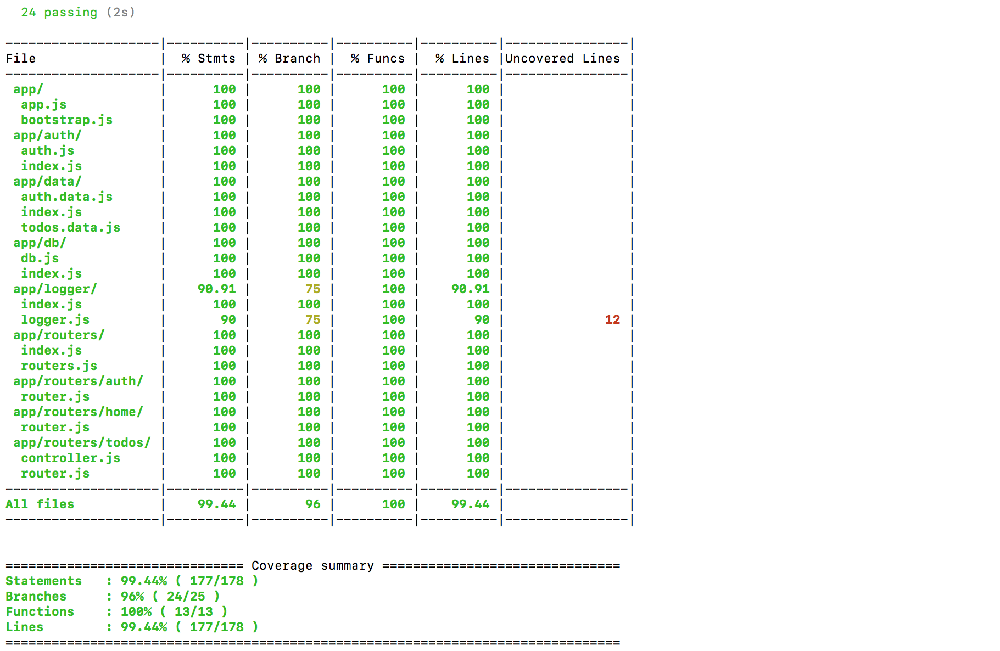

<!-- section start -->
<!-- attr: { id:'title', class:'slide-title', hasScriptWrapper:true } -->
# Testing with supertest and selenium Selenium WebDriver
## Integration and functional testing

    
Web applications with Node.js

    
Telerik Software Academy

    <a href="http://academy.telerik.com" class="signature-link">http://academy.telerik.com</a>

<!-- section start -->
<!-- attr: { id:'table-of-contents' } -->
# Table of Contents

- Code coverage
  - **Istanbul**
  - **Mocha**, **Chai** and **Istanbul** 
- Testing with **Supertest**
  - Testing `GET`, `POST`
  - Testing RESTful
  - Testing authenticated routes
  - Setup gulp task
- Testing with **Selenium WebDriver**
  - Setup selenium
    - GeckoDriver, ChromeDriver, Phantomjs
  - Setup gulp task

<!-- section start -->

<!-- attr: { class:'slide-section', id:'coming-next' } -->
# Code Coverage
## Overview

<!-- attr: { hasScriptWrapper: true, style: 'font-size:0.9em' }-->
# Code Coverage

> Code coverage measures the degree to which the source code 
> of am application is executed when a particular test suite runs

> <a href="https://en.wikipedia.org/wiki/Code_coverage" style="float: right">Wikipedia</a>

- High code coverage says that the tests go-though most of the source code

  **High code coverage does NOT neccessary mean our application is well tested!!!**  
  
Only that our tests go-through more code

<!-- attr: {style: 'font-size:0.9em'} -->
# Code Coverage

- There are a number of coverage criteria, the main ones being
  - **Function coverage**
    - Has each function (or subroutine) in the program been called?
  - **Statement coverage**
    - Has each statement in the program been executed?
  - **Branch coverage**
    - Has each branch of each control structure been executed? 
  - **Condition coverage**
    - Has each Boolean sub-expression evaluated both to true and false?

<!-- section start -->

<!-- attr: { class:'slide-section', id:'code-coverage-istanbul' } -->
# Code Coverage with Istanbul

# Code Coverage with Istanbul

- [Instanbul](https://github.com/gotwarlost/istanbul) is a code coverage tool in Node.js
  - Works with most testing frameworks:
    - Mocha, Jasmine, QUnit
- How to use it?
  1. `$ npm install --save-dev istanbul`
    - or `$ yarn add istanbul --dev`
  2. `$ istanbul mocha tests/**/*.js`
  3. Get the results

<!-- attr: {style: 'font-size:0.7em'}-->
# Code Coverage with Istanbul Result

<!-- attr: {class: 'slide-section' } -->
# Code Coverage with Istanbul
## [Demo](http://)

<!-- section start -->

# Testing with Supertest

- [Supertest](https://github.com/visionmedia/supertest) is a tool that mocks a Node.js `HTTP server`
  - Can mock express as well
- How does it work?
  - It fakes a web server and allows us to:
    - Create HTTP requests
    - Assert properties of the response

<!-- attr: {hasScriptWrapper: true } -->
# Testing with Supertest

  

    <strong style="text-align:center; display: block;">Export your app</strong>
    <pre><code>const express = require('express');
const app = express();
app.get('/', (req, res) => {
  return res.redirect('/home');
});

app.get('/home', (req, res) => {
  return res.render('home');
});

// more code
// more code
// more code
// more code

module.exports = app;</pre></code>
  

  

    <strong style="text-align:center; display: block;">Write your tests</strong>
    <pre><code>const request = require('supertest');
const app = require('../app');
describe('GET /', () => {
  it('expect to redirect to /home', (done) => {
    request(app)
      .get('/')
      .expect(304)
      .end((err, res) => {
        if(err) {
          return done(err);
        }

        return done();
      })
  });
});</pre></code>
  

<!-- attr: {hasScriptWrapper: true } -->
# Testing with Supertest

  

    <strong style="text-align:center; display: block;">Export your app</strong>
    <pre><code>const express = require('express');
const app = express();

app.post('/', (req, res) => {
  const item = req.body;
  if(!item) {
    return res.redirect(400, '/');
  }
  return data.add(item)
    .then(() => res.redirect('/' + item.id))
})

// more code
// more code
// more code
// more code
// more code
// more code
// more code

module.exports = app;</pre></code>
  

  

    <strong style="text-align:center; display: block;">Write your tests</strong>
    <pre><code>const request = require('supertest');
const app = require('../app');
describe('POST /', () => {
  it('expect to redirect to /:id', (done) => {
    request(app)
      .post('/')
      .send({
        text: 'It works!',
      })
      .expect(304)
      .end((err, res) => {
        if(err) {
          return done(err);
        }

        expect(res.header.location).to.start.with

        return done();
      })
  });
});</pre></code>
  

<!-- attr: {class: 'slide-section'} -->
# Testing with Supertest
## [Demo](http://)

<!-- section start -->

<!-- attr: {class: 'slide-section' } -->
# Testing with Selenium WebDriver
## Writing functional tests

# Testing with Selenium WebDriver

- Selenium is a testing framework for web applications
- Selenium WebDriver is a tool that accepts commands and sends them to the browser
  - Through a browser-specific browser driver
    - ChromeDriver, SafariDriver, EdgeDriver, GeckoDriver
  - Works well with headless browsers
    - PhantomJS

# Setting up Selenium

- Selenium is easy to setup:
  1.  Install Selenium Server
    - Install with package manager (apt-get, brew, choco)
    - Or download from [the site](http://www.seleniumhq.org/download/)
  2.  Run selenium server:
    - `$ java -jar /path/to/selenium-server.jar`
  3.  Install browser drivers:
    - `$ npm install -g chromedriver`
  4.  Ready for tests!

<!-- attr: { hasScriptWrapper: true, style: 'font-size: 0.9em'} -->
# Writing tests with selenium

- Selenium Web driver works with Mocha
  - `$ npm install --save-dev selenium-webdriver`
    - Or `$ yarn add selenium-webdriver --dev`

  

    <strong style="text-align:center; display: block;">Export your app</strong>
    <pre><code>const webdriver = require('selenium-webdriver');

const setupDriver = (browser) => {
const driver = new webdriver.Builder()
    .usingServer('http:/&#47;localhost:4444/wd/hub')
    .withCapabilities({
        browserName: browser,
    }))
    .build();

  return driver;
};

module.exports = { setupDriver };

</pre></code>
  

  

    <strong style="text-align:center; display: block;">Write your tests</strong>
    <pre><code>const { setupDriver } = require('../utils/setup.driver.js');
describe('Tests', () => {
  let driver = null;

  beforeEach(() => {
      driver = setupDriver('chrome');
  });

  it('telerikacademy.com title', () => {
    return driver.get('http:/&#47;telerikacademy.com')
      .then(() => {
        return driver.getTitle();
      })
      .then((title) => {
        expect(title).to.equal(expectedTitle);
      });
  });
})</pre></code>
  

<!-- attr: {class: 'slide-section' } -->
# Testing with Selenium WebDriver
## [Demo](http://)

<!-- section start -->

<!-- attr: { id:'questions', class:'slide-section' } -->
# Questions
## The Web Applications with Node.js
[link to the forum](http://telerikacademy.com/Forum/Category/60/end-to-end-javascript-applications)
